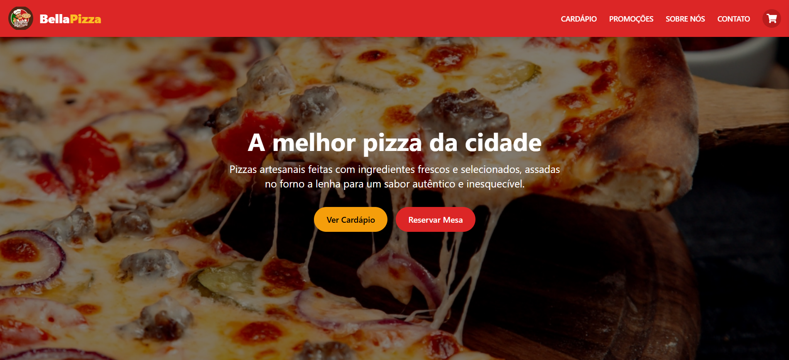

# 🍕 Pizzaria Web  

Aplicação web moderna desenvolvida com **React**, **Next.js**, **TypeScript** e **Tailwind CSS**, simulando o site de uma pizzaria.  
O projeto oferece uma interface interativa e responsiva, permitindo que o usuário explore o cardápio e visualize os produtos de forma prática e agradável.  

---

## 🚀 **Demonstração**
🔗 [Acesse o projeto online](https://pizzaria-web-drab.vercel.app/)

---

## 🧠 **Sobre o projeto**

A **Pizzaria Web** foi criada com o objetivo de praticar o desenvolvimento de **interfaces modernas e componentizadas** utilizando o ecossistema do React e o poder do Next.js para otimização e desempenho.  
O layout foi pensado para refletir a identidade de uma pizzaria real, priorizando **experiência do usuário**, **organização visual** e **design responsivo** com Tailwind CSS.  

---

## ⚙️ **Funcionalidades**
- 🍕 Exibição de cardápio com categorias de sabores  
- 🧭 Navegação intuitiva entre seções  
- 📱 Layout totalmente responsivo  
- ⚡ Performance otimizada com Next.js  
- 🧩 Componentização reutilizável com React e TypeScript  

---

## 🛠️ **Tecnologias utilizadas**

| Tecnologia | Descrição |
|-------------|------------|
| **React** | Biblioteca para criação de interfaces dinâmicas |
| **Next.js** | Framework para renderização otimizada e rotas automáticas |
| **TypeScript** | Tipagem estática para maior segurança e produtividade |
| **Tailwind CSS** | Framework de estilização com classes utilitárias |
| **Vercel** | Plataforma de deploy para aplicações Next.js |

---

## 📸 **Preview**

*(Substitua por uma imagem real do projeto — basta capturar a tela principal e salvar como `preview.png` na raiz do repositório.)*

---

## 📚 **Aprendizados**
Durante o desenvolvimento, aprimorei:
- Organização de pastas e componentes em Next.js  
- Uso de **TypeScript** para melhorar legibilidade e evitar erros  
- Estilização responsiva com **Tailwind CSS**  
- Boas práticas de **componentização e reuso de código**  
- Deploy otimizado na **Vercel**  

---

## 🔮 **Melhorias futuras**
- Implementar sistema de carrinho de compras  
- Adicionar integração com API de pedidos  
- Criar painel administrativo para controle do cardápio  

---

## 👨‍💻 **Autor**
**Josué Bezerra Soares**  
💼 [LinkedIn](https://www.linkedin.com/in/josue-soares-dev/)  
🌐 [Portfólio](https://josuesoaresdev.vercel.app/)  
📧 josue.bezerra.2020@gmail.com  

---

⭐ *Se gostou do projeto, não esqueça de deixar uma estrela no repositório!*
